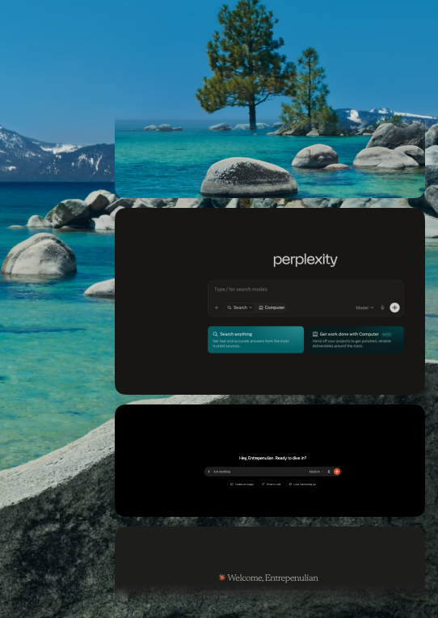

<div align="center">

# MacSnap

**Screenshots that file themselves — and a screen recorder to match.**

A native macOS menu-bar app that catches every screenshot the moment you take it, lets you drop it into the right Desktop folder from a clean floating panel, and records your screen, a window, or a dragged area to **video or GIF** — with resize handles, Pause/Stop controls, and global shortcuts.

Built like the paid tools. Priced like open source: free.


<br>


</div>

## The problem it solves

You take a screenshot. It drops onto your Desktop with a name only a machine could love. A week later your Desktop is a wall of them.

MacSnap fixes the last step. The instant a screenshot is saved, a panel appears in the corner. Hover it, hit **Save**, pick a folder. The file moves to `~/Desktop/<folder>/` and your Desktop stays clean.

## Features

**It appears instantly.** MacSnap detects the shot the moment the file finishes writing, so the panel is there as fast as macOS can hand it over. No artificial delay.

**At rest, it's just your screenshot.** No borders, no chrome. The real shot, sitting in the corner.


**Hover to reveal the controls.** A frosted-glass panel rises over a softly blurred preview: Copy, Save, Markup, Share. Monochrome, no glow, no noise.

**Your folders, not your clutter.** The picker starts with one option, Desktop. It never lists your whole Desktop. It only remembers the folders *you* make through it, so the list stays yours.


**Create a folder as you type.** Type a name, press Return, and MacSnap makes the folder on your Desktop and files the shot into it. Next time, it's there to search.


**Stack them.** Take a few in a row and they stack in the corner, newest on top, each at its real proportions — rock steady, the ones already there never budge when a new one lands. Once you're past three, the stack turns into a smooth scroll-through column: no scroll bar, the top and bottom edges softly fade so nothing ever gets buried, and your cursor anywhere over the stack scrolls it. File them whenever you're ready; dismiss one and the rest slide up to fill the gap.



**Screenshot a web page.** Pick **Screenshot site** from the menu and MacSnap captures exactly the page you're looking at in your browser — just the content, no tabs or toolbar — straight into the corner, ready to file like any other shot.

**Pin the keepers.** The menu-bar icon holds a gallery of the screenshots you pin — real copies that stick around even if you move or delete the original. Drag any pin out into another app, or click it to open.

**Drag images in from anywhere.** Drag an image onto the menu-bar icon — from Finder, or straight out of a browser, Preview, or Photos. MacSnap opens as you hover; let go on the icon, or carry on into the pinned section and drop there. Either way it's pinned (files keep their original; raw images are saved as PNG).

**Right-click to copy.** Right-click any pinned shot for **Copy**, **Open**, or **Unpin**. Copy puts the image on the clipboard — image first, so it pastes into chat boxes and editors as a picture — then closes the panel and hands focus back to the app you were in, so you can paste right away.

**It stays on your Mac.** No account, no cloud, no telemetry. MacSnap moves files on your own disk. Nothing leaves.

## Record video & GIF

Pick **Record** from the menu and MacSnap walks you through a small floating flow at the bottom of the screen — each step a calm cross-fade into the next.

**1 — Choose the format.** Video or GIF.


**2 — Choose what to record.** Drag an **Area**, click a **Window**, or take the whole **Screen**. In Window mode, hovering dims everything else so the window under your cursor clearly stands out — click it to pick it.


**3 — Dial in the area.** An area selection isn't locked in on release: it gets a white dashed frame with blue handles you can drag to resize, or grab the middle to move. The live pixel size shows as you go. When it's right, hit **Start Recording**.


**4 — Record, pause, stop.** A control bar floats with a rolling timer and **Pause** / **Stop** — each labelled with its shortcut. Press **⌘P** to pause and **⌘S** to stop from anywhere, even when another app is focused (they override that app's bindings while you record). The rest of the screen is click-through, so a window recording stays fully usable — move it, type into it, keep working — and it still captures just that window.


When you stop, the recording saves to `~/Desktop/MacSnap Recordings/` and opens in a Liquid-Glass preview with the native macOS media controls. Pin a recording and it shows in the gallery with a play badge; click to watch.

## Install

Hand this to your coding agent (Claude Code, Cursor, Codex, and friends) and let it do the setup:

```
Clone https://github.com/Entrepenulian/MacSnap, run ./build-app.sh, move
macsnap.app to /Applications, and open it.
```

## Using it

1. Take a screenshot the way you always do (`⌘⇧4`, `⌘⇧3`, etc.).
2. The panel appears in the bottom-right.
3. Hover it, hit **Save**, and pick or create a folder. Done.

Not ready to file it? Ignore the panel and the shot stays on your Desktop like normal. MacSnap never deletes anything — it only moves a file when you choose a folder.

Menu-bar icon → **Catch the latest screenshot** pops the panel on your most recent shot, handy for trying it without taking a new one. **Record** starts the video/GIF flow.

## How it works

- **Detection:** watches your screenshot folder and fires the instant a new capture's file is complete (it checks the file's end-of-file marker rather than guessing with a delay).
- **The panel:** a borderless, non-activating window that floats over whatever you're doing without stealing focus.
- **Filing:** moves the file into `~/Desktop/<folder>`, creating the folder if it's new, and remembers it for next time.
- **Recording:** ScreenCaptureKit captures the display, window, or cropped area; frames are H.264-encoded to MP4 in real time via AVAssetWriter (paused spans are dropped and re-timed out of the video), and GIFs are transcoded from the MP4 with ImageIO. Global ⌘P/⌘S use Carbon hot keys, so they fire system-wide without Accessibility permission.

## Build from source

```bash
swift build                    # debug build
swift run macsnap              # run from the terminal
swift run macsnap --selftest   # filing + detection self-tests
./build-app.sh                 # release .app bundle
```

## Project layout

```
Sources/macsnap/
  main.swift              entry point + CLI flags
  AppController.swift     menu bar, wiring, login-item / thumbnail toggle
  ScreenshotWatcher.swift detects new screenshots the instant they finish
  FolderStore.swift       remembers your folders, creates + moves files
  Overlay.swift           the one scrollable panel that hosts the corner stack
  ShotView.swift          the SwiftUI glass card UI
  Gallery.swift           the menu-bar dropdown + pinned-shots gallery
  PinStore.swift          keeps pinned screenshots + recordings for the gallery
  WebCapture.swift        finds a browser's visible page region (for Screenshot site)
  RecordingController.swift orchestrates a recording: permission, picker, save
  RecordSelection.swift   the record picker + resize handles + Pause/Stop controls
  ScreenRecorder.swift    ScreenCaptureKit → AVAssetWriter MP4 (with pause/resume)
  GlobalHotKeys.swift     system-wide ⌘P / ⌘S while recording (Carbon hot keys)
  GIFExporter.swift       transcodes a recorded MP4 into a looping GIF
  MediaViewer.swift       Liquid-Glass preview window with native media controls
```

## Built with

Swift 6, SwiftUI + AppKit, Swift Package Manager. No third-party dependencies.

## License

[MIT](LICENSE). Use it, fork it, ship it.
